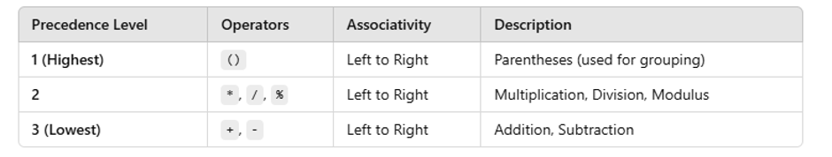

<h1 align="center">C Notes</h1>

- [1. Part 1: Language](#1-part-1-language)
  - [1.1. Chapter 1: Basic Syntax, Variables and Data Types:](#11-chapter-1-basic-syntax-variables-and-data-types)
    - [1.1.3. First C Program:](#113-first-c-program)
    - [1.1.4. Comments:](#114-comments)
    - [1.1.5. Data Types and Variables:](#115-data-types-and-variables)
      - [Data Types:](#data-types)
      - [Variables:](#variables)
    - [1.1.6. Data Types Limitations:](#116-data-types-limitations)
    - [1.1.7. How to Take Input:](#117-how-to-take-input)
    - [1.1.8. Pre and Post Increment/Decrement:](#118-pre-and-post-incrementdecrement)
    - [1.1.9. Operator Precedence:](#119-operator-precedence)
    - [Escape sequence:](#escape-sequence)
  - [1.2. Chapter 2: Operators and Conditional Statement(if-else):](#12-chapter-2-operators-and-conditional-statementif-else)
    - [1.2.1. Arithmetic Operators(+, -, \*, /, %):](#121-arithmetic-operators-----)
    - [1.2.2. Relational Operators(\>, \<, \>=, \<=, ==, !=):](#122-relational-operators-----)
    - [1.2.3. Logical Operators(\&\&, ||, !):](#123-logical-operators--)
    - [1.2.4. If-Else:](#124-if-else)
    - [1.2.5. If-Else Ladder:](#125-if-else-ladder)
    - [1.2.6. Nested If-Else:](#126-nested-if-else)
  - [1.3. Chapter 3: Loop:](#13-chapter-3-loop)
    - [1.3.1. For-Loop:](#131-for-loop)
    - [1.3.2. Break Statement:](#132-break-statement)
    - [1.3.3. Continue Statement:](#133-continue-statement)
    - [1.3.4. While and Do-While Loop:](#134-while-and-do-while-loop)
    - [1.3.5. Nested Loop:](#135-nested-loop)
  - [1.4. Chapter 4: Array:](#14-chapter-4-array)
    - [1.4.1. What is Array:](#141-what-is-array)
    - [1.4.2. Array Input and Output:](#142-array-input-and-output)
    - [1.4.3. Printing Reverse of an Array:](#143-printing-reverse-of-an-array)
    - [1.4.4. Reverse Array Element(Two Pointers Technique):](#144-reverse-array-elementtwo-pointers-technique)
    - [1.4.5. Selection Sort:](#145-selection-sort)
    - [1.4.6. Sum of an Array:](#146-sum-of-an-array)
    - [1.4.7. Counting Array:](#147-counting-array)
    - [1.4.8. Sum of Two Value Equal X:](#148-sum-of-two-value-equal-x)
    - [1.4.9. Insert Element in Array:](#149-insert-element-in-array)
    - [1.4.10. Remove Element from an Array:](#1410-remove-element-from-an-array)
    - [1.4.11. Array Concatenation:](#1411-array-concatenation)
  - [1.5. Chapter 5: 2D Array:](#15-chapter-5-2d-array)
    - [1.5.1. What is 2D Array:](#151-what-is-2d-array)
    - [1.5.2. 2D Array Input and Output:](#152-2d-array-input-and-output)
    - [1.5.3. How to Print Specific Row and Column in 2D Array:](#153-how-to-print-specific-row-and-column-in-2d-array)
    - [1.5.4. Different types of Matrix:](#154-different-types-of-matrix)
  - [1.6. chapter 6: Introduction to String:](#16-chapter-6-introduction-to-string)
    - [1.6.1. What is String:](#161-what-is-string)
    - [1.6.2. String Input and Output:](#162-string-input-and-output)
    - [1.6.3. Length of a String:](#163-length-of-a-string)
    - [1.6.4. String Copy:](#164-string-copy)
    - [1.6.5. String Lexicographical Comparison:](#165-string-lexicographical-comparison)
    - [1.6.6. String Concatenation:](#166-string-concatenation)
    - [1.6.7. Counting or Frequency String:](#167-counting-or-frequency-string)
  - [1.7. Chapter 7: Function:](#17-chapter-7-function)
    - [1.7.1. What is Function:](#171-what-is-function)
    - [1.7.2. Return + Parameter:](#172-return--parameter)
    - [1.7.3. Return + No Parameter:](#173-return--no-parameter)
    - [1.7.4. No Return + Parameter:](#174-no-return--parameter)
    - [1.7.5. No Return + No Parameter:](#175-no-return--no-parameter)
    - [1.7.6. Useful Built-In Functions:](#176-useful-built-in-functions)
    - [1.7.7. Scopes in C:](#177-scopes-in-c)
  - [1.8. Chapter 8: Recursion:](#18-chapter-8-recursion)
    - [1.8.1. Call Stack:](#181-call-stack)
    - [1.8.2. What is Recursion:](#182-what-is-recursion)
    - [1.8.3. Print 1 to 5 using Recursion:](#183-print-1-to-5-using-recursion)
    - [1.8.4. Print 5 to 1 using Recursion:](#184-print-5-to-1-using-recursion)
    - [1.8.5. Printing Array using Recursion:](#185-printing-array-using-recursion)
    - [1.8.6. Length of a String using Recursion:](#186-length-of-a-string-using-recursion)
  - [1.9. Chapter 9: Pointer:](#19-chapter-9-pointer)
    - [1.9.1. Pointers:](#191-pointers)
    - [1.9.2. Call by Value or Pass By Value:](#192-call-by-value-or-pass-by-value)
    - [1.9.3. Call by Reference or Passed by Reference(Pointer Dereferencing Technique):](#193-call-by-reference-or-passed-by-referencepointer-dereferencing-technique)
    - [1.9.4. Relation Between Array and Pointer:](#194-relation-between-array-and-pointer)
    - [1.9.5. How to Pass Array into a Function:](#195-how-to-pass-array-into-a-function)
    - [1.9.6. How to pass String into a Function:](#196-how-to-pass-string-into-a-function)
- [2. Part 2: Problem Solving:](#2-part-2-problem-solving)

# 1. Part 1: Language
## 1.1. Chapter 1: Basic Syntax, Variables and Data Types:
### 1.1.3. First C Program: 

```c
#include <stdio.h> 
int main() { 
    
    printf("Hello World"); // Hello World 

    return 0; 
}
```

Behind the Code:
- `#include <stdio.h>`: It is a preprocessor directive. It tells the preprocessor to include the contents of the stdio.h file before the actual compilation of the program.
  - Preprocessor: A program/tool that processes the source code before the actual compilation begins.
  - Directive: A special instruction for the preprocessor. Directives start
  with the # symbol. Common examples are #include, #define, #ifdef etc.
- `int main()`: The main() function is the starting point of every C program. No matter how much code we write, program execution starts from the main() function. 
  - `printf("Hello World");`: printf() function is used to display output on the screen. Its comes from `<stdio.h>` library.
  - `return 0;`: return sends a value back from the function and 0 in the main function usually means the program finished successfully. 

### 1.1.4. Comments:

```c
#include <stdio.h> 
 
int main() 
{ 
    // This is a single line comment 
    /* 
        This is a 
        Multiline 
        Comment 
    */ 
 
    return 0; 
} 
```

### 1.1.5. Data Types and Variables:
#### Data Types: 
A data type defines what kind of data a variable can store.

| Data Type       | Examples                        | Format Specifier                |
| --------------- | ------------------------------- | ------------------------------- |
| `int`           | `-4, -3, -2, -1, 0, 1, 2, 3, 4` | `%d`                            |
| `long long int` | `-4, -3, -2, -1, 0, 1, 2, 3, 4` | `%lld`                          |
| `float`         | `-4.53, -3.45, 1.5, 3.1416`     | `%f`                            |
| `double`        | `-4.53, -3.45, 1.5, 3.1416`     | `%lf`                           |
| `char`          | `'1', '5', 'A', '@'`            | `%c`                            |
| `bool`          | `true(1)` or `false(0)`         | `%d` *(requires `<stdbool.h>`)* |

#### Variables: 
A variable is a named memory location that store data based on its `date types`.

```c
int a = 10;

// or

int b; 
b = 20; 
```

```c
#include <stdio.h> 
#include <stdbool.h> 
 
int main() { 
    int myInt = 2147483647; 
    long long int myLongLongInt = 9223372036854775807; 
    float myFloat = 1.123456; 
    double myDouble = 1.12345678912345; 
    char myChar = 'a'; 
    bool myBool = true; 
 
    printf("myInt: %d\n", myInt); // 2147483647
    printf("myLongLongInt: %lld\n", myLongLongInt); // 9223372036854775807 
    printf("myFloat: %f\n", myFloat); // 1.123456
    printf("myFloat: %.2f\n", myFloat); // 1.12
    printf("myDouble: %.15lf\n", myDouble); // 1.123456789123450
    printf("myChar: %c\n", myChar); // a
    printf("myBool: %d\n", myBool); // 1 (true)
 
    return 0; 
}
```

### 1.1.6. Data Types Limitations:

- Int = 4 bytes = 32 bits = 2^32 = 4,294,967,296 = −2,147,483,648 to 2,147,483,647 = 10^9 = it allows up to approximately 10 digits 
- long long int = 8 bytes = 64 bits = 2^64 = 18,446,744,073,709,551,616 = -9,223,372,036,854,775,808 to 9,223,372,036,854,775,807 = 10^18 = it allows up to approximately 19 digits 
- float = 4 bytes = 32 bits = 10^6 = it allows up to approximately 7 digits precision (1.123456 = 7 digits) 
- double = 8 bytes = 64 bits = 10^14 = it allows up to approximately 15 digits precision (1.12345678912345 = 15 digits)
- char = 1 byte = 8 bits = 2^8 = 256 = -128 to 127 (65 = A, 90 = Z, 97 = a, 122 = z) 

```c
#include <stdio.h>
#include <limits.h>
#include <float.h>

int main(void)
{
    printf("char: %zu bytes, range %d to %d\n",
           sizeof(char), CHAR_MIN, CHAR_MAX); // char: 1 bytes, range -128 to 127

    printf("int: %zu bytes, range %d to %d\n",
           sizeof(int), INT_MIN, INT_MAX); // int: 4 bytes, range -2147483648 to 2147483647

    printf("long long int: %zu bytes, range %lld to %lld\n",
           sizeof(long long int), LLONG_MIN, LLONG_MAX); // long long int: 8 bytes, range -9223372036854775808 to 9223372036854775807

    printf("float: %zu bytes, range %e to %e\n",
           sizeof(float), -FLT_MAX, FLT_MAX); // float: 4 bytes, range -3.402823e+38 to 3.402823e+38

    printf("double: %zu bytes, range %e to %e\n",
           sizeof(double), -DBL_MAX, DBL_MAX); // double: 8 bytes, range -1.797693e+308 to 1.797693e+308

    return 0;
}
```

Note: 
- 1 bit = 0 or 1
- 8 bit = 1 byte
- 1024 bytes = 1 KB
- 1024 KB = 1 MB
- 1024 MB = 1GB
- 1024 GB = 1 TB

### 1.1.7. How to Take Input:

```c
#include <stdio.h>
int main()
{
    int myInt;
    float myFloat;
    char myChar;

    scanf("%d", &myInt); // & = address of operator or ampersand operator. Its gives the memory address of the variable.
    scanf("%f", &myFloat);
    scanf(" %c", &myChar); //The space before %c to consume any leftover newline character

    printf("Integer: %d\n", myInt);
    printf("Float: %f\n", myFloat);
    printf("Float: %.2f\n", myFloat);
    printf("Character: %c\n", myChar);

    return 0;
}
```

Note: We can also use `getchar()` and `putchar()` functions to take input and output for single character only.

```c
#include <stdio.h>
int main()
{
    char myChar;
    myChar = getchar();
    putchar(myChar); // Output the character read from input

    return 0;
}
```

Note: 
- We cannot directly call the `getchar()` function. Instead, we must assign the `getchar()` function to a variable. 
- We are not allowed to add any additional text inside the `putchar()` function and The `putchar()` function must strictly be used to print a single character.

### 1.1.8. Pre and Post Increment/Decrement:
- Pre: 
```c
#include <stdio.h>
int main(){
    int i = 10;
    int x = ++i;
    // ------------->

    printf("x = %d\n", x);
    printf("i = %d", i);

    return 0;
}
```
Note: Here, i is incremented to 11 first, and then this new value is assigned to x. Both i and x are 11 after this operation.

- Post: 
```c
#include <stdio.h>
int main(){
    int i = 10;
    int x = i++;
    // ------------->

    printf("x = %d\n", x);
    printf("i = %d", i);

    return 0;
}
```

Note: First, the value of i (which is 10) is assigned to the variable x. After that, i is incremented, so i becomes 11.

Note: 
Pre-increment (++i): First increments the value of i, then assigns it.
Post-increment (i++): First assigns the value, then increments i.


### 1.1.9. Operator Precedence:


```
So, if you write an expression like:
int result = 10 + 5 - 2 / 2 * 3; 
10 + 5 – 1 * 3
10 + 5 – 3
15 – 3
12
Final result = 12
```

### Escape sequence:
An escape sequence is a special character combination that starts with a backslash `\` and represents a character or action that is difficult to write directly in the printf function.

| Escape Sequence | Meaning | Example Output |
|-----|-----|-----|
| `\n` | New line | Moves to the next line |
| `\t` | Horizontal tab | Adds a tab space |
| `\\` | Backslash | `\` |
| `\"` | Double quotation mark | `"` |
| `\'` | Single quotation mark | `'` |
| `\0` | Null character | Marks the end of a C string |
| `\b` | Backspace | Moves back one character position |
| `\r` | Carriage return | Moves to the beginning of the current line |
| `\a` | Alert/bell | Requests an alert sound |
| `\f` | Form feed | Advances to the next page (historical use) |
| `\v` | Vertical tab | Adds a vertical tab |
| `\?` | Question mark | `?` |

```c
#include <stdio.h>
int main() {
    printf("Hello, World!\n");
    printf("This is a new line.\n");
    printf("This is a tab: \tHello\n");
    return 0;
}
```

## 1.2. Chapter 2: Operators and Conditional Statement(if-else):
### 1.2.1. Arithmetic Operators(+, -, *, /, %):
### 1.2.2. Relational Operators(>, <, >=, <=, ==, !=):
### 1.2.3. Logical Operators(&&, ||, !):
### 1.2.4. If-Else:
### 1.2.5. If-Else Ladder:
### 1.2.6. Nested If-Else:

## 1.3. Chapter 3: Loop: 
### 1.3.1. For-Loop:
### 1.3.2. Break Statement:
### 1.3.3. Continue Statement:
### 1.3.4. While and Do-While Loop:
### 1.3.5. Nested Loop:

## 1.4. Chapter 4: Array:
### 1.4.1. What is Array:
### 1.4.2. Array Input and Output:
### 1.4.3. Printing Reverse of an Array:
### 1.4.4. Reverse Array Element(Two Pointers Technique):
### 1.4.5. Selection Sort:
### 1.4.6. Sum of an Array:
### 1.4.7. Counting Array:
### 1.4.8. Sum of Two Value Equal X:
### 1.4.9. Insert Element in Array:
### 1.4.10. Remove Element from an Array:
### 1.4.11. Array Concatenation:

## 1.5. Chapter 5: 2D Array:
### 1.5.1. What is 2D Array:
### 1.5.2. 2D Array Input and Output:
### 1.5.3. How to Print Specific Row and Column in 2D Array:
### 1.5.4. Different types of Matrix:

## 1.6. chapter 6: Introduction to String:
### 1.6.1. What is String:
### 1.6.2. String Input and Output:
### 1.6.3. Length of a String:
### 1.6.4. String Copy:
### 1.6.5. String Lexicographical Comparison:
### 1.6.6. String Concatenation:
### 1.6.7. Counting or Frequency String:

## 1.7. Chapter 7: Function:
### 1.7.1. What is Function:
### 1.7.2. Return + Parameter:
### 1.7.3. Return + No Parameter:
### 1.7.4. No Return + Parameter:
### 1.7.5. No Return + No Parameter:
### 1.7.6. Useful Built-In Functions:
### 1.7.7. Scopes in C:

## 1.8. Chapter 8: Recursion:
### 1.8.1. Call Stack:
### 1.8.2. What is Recursion:
### 1.8.3. Print 1 to 5 using Recursion:
### 1.8.4. Print 5 to 1 using Recursion:
### 1.8.5. Printing Array using Recursion:
### 1.8.6. Length of a String using Recursion:

## 1.9. Chapter 9: Pointer:
### 1.9.1. Pointers:
### 1.9.2. Call by Value or Pass By Value:
### 1.9.3. Call by Reference or Passed by Reference(Pointer Dereferencing Technique):
### 1.9.4. Relation Between Array and Pointer:
### 1.9.5. How to Pass Array into a Function:
### 1.9.6. How to pass String into a Function:

# 2. Part 2: Problem Solving: